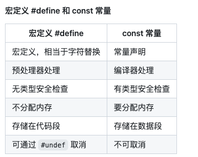
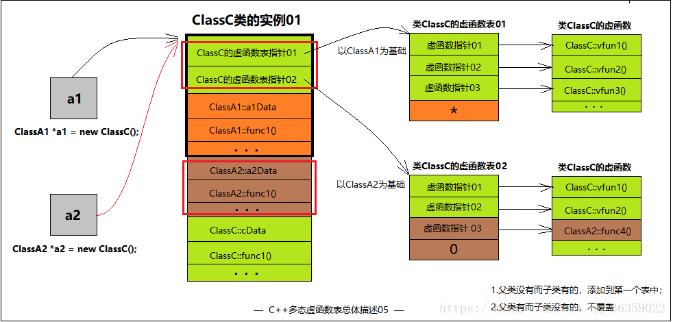

[toc]

## 类和内存

C++程序的内存格局通常分为四个区：***全局数据区(data area)，代码区(code area)，栈区(stack area)，堆区(heap area)(即自由存储区)***。全局数据区存放全局变量，静态数据和常量；所有类成员函数和非成员函数代码存放在代码区；为运行函数而分配的局部变量、函数参数、返回数据、返回地址等存放在栈区；余下的空间都被称为堆区。根据这个解释，我们可以得知在类的定义时，**类成员函数是被放在代码区，而类的静态成员变量在类定义时就已经在全局数据区分配了内存，因而它是属于类的。对于非静态成员变量，我们是在类的实例化过程中(构造对象)才在栈区或者堆区为其分配内存，是为每个对象生成一个拷贝，所以它是属于对象的。**

应当说明，常说的“某某对象的成员函数”，是从逻辑的角度而言的，而成员函数的存储方式，是从物理的角度而言的，二者是不矛盾的。

下面我们再来讨论下类的静态成员函数和非静态成员函数的区别：***静态成员函数和非静态成员函数都是在类的定义时放在内存的代码区的，因而可以说它们都是属于类的***，但是类为什么只能直接调用静态类成员函数，而非静态类成员函数(即使函数没有参数)只有类对象才能调用呢？原因是类的非静态类成员函数其实都内含了一个指向类对象的指针型参数(即this指针)，因而只有类对象才能调用(此时this指针有实值)。

需要说明，不论成员函数在类内定义还是在类外定义，成员函数的代码段都用同一种方式存储。不要将成员函数的这种存储方式和inline(内联)函数的概念混淆。不要误以为用inline声明(或默认为inline)的成员函数，其代码段占用对象的存储空间，而不用inline声明的成员函数，其代码段不占用对象的存储空间。**不论是否用inline声明(或默认为inline)，成员函数的代码段都不占用对象的存储空间。用inline声明的作用是在调用该函数时，将函数的代码段复制插人到函数调用点，而若不用inline声明，在调用该函数时，流程转去函数代码段的入口地址，在执行完该函数代码段后，流程返回函数调用点。**inline与成员函数是否占用对象的存储空间无关，它们不属于同一个问題，不应搞混。

### 空类，定义时会生成6个成员函数
当空类Empty_one定义一个对象时Empty_one pt;sizeof(pt)仍是为1，但编译器会生成6个成员函数：一个缺省的构造函数、一个拷贝构造函数、一个析构函数、一个赋值运算符、两个取址运算符。
```C++
    class Empty
    {};
```
等价于：
```C++
    class Empty
    {
      public:
        Empty();                            //缺省构造函数
        Empty(const Empty &rhs);            //拷贝构造函数
        ~Empty();                           //析构函数 
        Empty& operator=(const Empty &rhs); //赋值运算符
        Empty* operator&();                 //取址运算符
        const Empty* operator&() const;     //取址运算符(const版本)
    };
```

## class和struct区别

- 总的来说，struct 更适合看成是一个数据结构的实现体，class 更适合看成是一个对象的实现体。
- C的struct与C++的class的区别：struct只是作为一种复杂数据类型定义，不能用于面向对象编程。
- C++中的struct和class的区别：对于成员访问权限以及继承方式，class中默认的是private的，而struct中则是public的。class还可以用于表示模板类型，struct则不行。

## protected、private、public成员、继承

在没有继承的情况下，protected跟private相同，在派生类的时候才出现分化。priavte对派生类不可见，但是派生类可以访问基类protected成员。


#### const

**常类型是指使用类型修饰符const说明的类型，常类型的变量或对象的值是不能被更新的,就如同常数一样使用。因为常量在定以后就不能被修改，所以定义时必须初始化！类中const成员必须通过初始化列表初始化**

```C++
const int function(const int var) const{}
```

返回值const，但是因为一般使用copy constructor，此const没有意义，可以返回给任意

函数参数const，传递过来的参数var不能改变，保护只读参数

函数是const，,在这个函数中的任何试图改变成员变量和调用非const成员函数的操作都被视为非法。

```C++
int Stack::functiont(void)  const 
{ 
   ++ m_num; // 编译错误，企图修改数据成员 m_num 
   Pop();  // 编译错误，企图调用非const 函数 
   return m_num; 
 }
```

只能使用const引用指向const变量，只能指向const的指针指向cosnt变量

```C++
const int *p; //p是指向const常量的指针 （*ptr 是const的
int * const p; //p指针是常量指向地址不可更改 （ptr 是const的
```



#### static

1. static全局变量与普通的全局变量有什么区别 ?
   　 　全局变量(外部变量)的说明之前再冠以static 就构成了静态的全局变量。
   　　  全局变量本身就是静态存储方式， 静态全局变量当然也是静态存储方式。 这两者在存储方式上并无不同。
   　　  这两者的区别在于非静态全局变量的作用域是整个源程序， 当一个源程序由多个源文件组成时，非静态的全局变量在各个源文件中都是有效的。 而静态全局变量则限制了其作用域， 即只在定义该变量的源文件内有效， 在同一源程序的其它源文件中不能使用它。由于静态全局变量的作用域局限于一个源文件内，只能为该源文件内的函数公用，因此可以避免在其它源文件中引起错误。 
   　　  static全局变量只初使化一次，防止在其他文件单元中被引用; 
2. static局部变量和普通局部变量有什么区别 ？
    　　把局部变量改变为静态变量后是改变了它的存储方式即改变了它的生存期。把全局变量改变为静态变量后是改变了它的作用域，限制了它的使用范围。  
          static局部变量只被初始化一次，下一次依据上一次结果值；
3. static函数与普通函数有什么区别？
   　　 static函数与普通函数作用域不同,仅在本文件。只在当前源文件中使用的函数应该说明为内部函数(static修饰的函数)，内部函数应该在当前源文件中说明和定义。对于可在当前源文件以外使用的函数，应该在一个头文件中说明，要使用这些函数的源文件要包含这个头文件.
4. 修饰成员变量，修饰成员变量使所有的对象只保存一个该变量，而且不需要生成对象就可以访问该成员。
5. 修饰成员函数，修饰成员函数使得不需要生成对象就可以访问该函数，但是在 static 函数内不能访问非静态成员。　　static函数在内存中只有一份，普通函数在每个被调用中维持一份拷贝。
   **当我们同时编译多个文件时，所有未加static前缀的全局变量和函数都具有全局可见性**


#### this

1. `this` 指针是一个隐含于每一个非静态成员函数中的特殊指针。它指向调用该成员函数的那个对象。
2. 当对一个对象调用成员函数时，编译程序先将对象的地址赋给 `this` 指针，然后调用成员函数，每次成员函数存取数据成员时，都隐式使用 `this` 指针。
3. 当一个成员函数被调用时，自动向它传递一个隐含的参数，该参数是一个指向这个成员函数所在的对象的指针。

#### inline

- 相当于把内联函数里面的内容写在调用内联函数处；
- 相当于不用执行进入函数的步骤，直接执行函数体，不需要函数调用；
- 相当于宏，却比宏多了类型检查，真正具有函数特性；
- 简单的函数
- 在类声明中定义的函数，除了虚函数的其他函数都会自动隐式地当成内联函数
- 编译阶段

虚函数可以inline

- 虚函数可以是内联函数，内联是可以修饰虚函数的，但是当虚函数表现多态性的时候不能内联。
- 内联是在编译期建议编译器内联，而虚函数的多态性在运行期，编译器无法知道运行期调用哪个代码，因此虚函数表现为多态性时（运行期）不可以内联。
- `inline virtual` 唯一可以内联的时候是：编译器知道所调用的对象是哪个类（如 `Base::who()`），这只有在编译器具有实际对象而不是对象的指针或引用时才会发生。

#### Volatile

- volatile 关键字是一种类型修饰符，用它声明的类型变量表示可以被某些编译器未知的因素（操作系统、硬件、其它线程等）更改。所以使用 volatile 告诉编译器不应对这样的对象进行优化。
- volatile 关键字声明的变量，每次访问时都必须从内存中取出值（没有被 volatile 修饰的变量，可能由于编译器的优化，从 CPU 寄存器中取值）

#### assert()

断言，是宏，而非函数。

```c++
assert( p != NULL );
```

#### typedef

```C++
typedef struct Student { 
    int age; 
} S;

void Student() {}           // 正确，定义后 "Student" 只代表此函数

//void S() {}               // 错误，符号 "S" 已经被定义为一个 "struct Student" 的别名

int main() {
    Student(); 
    struct Student me;      // 或者 "S me";
    return 0;
}
```

#### using

一条 `using 声明` 语句一次只引入命名空间的一个成员。它使得我们可以清楚知道程序中所引用的到底是哪个名字。如：

```C++
using namespace_name::name;
```

`using 指示`

`using 指示` 使得某个特定命名空间中所有名字都可见，这样我们就无需再为它们添加任何前缀限定符了。如：

```C++
using namespace_name name;
```

**尽量少使用 `using 指示` 污染命名空间**

尽量少使用 `using 指示`

```
using namespace std;
```

应该多使用 `using 声明`

```
int x;
std::cin >> x ;
std::cout << x << std::endl;
```

或者

```c++
using std::cin;
using std::cout;
using std::endl;
```

#### :: 范围解析运算符

分类

1. 全局作用域符（`::name`）：用于类型名称（类、类成员、成员函数、变量等）前，表示作用域为全局命名空间
2. 类作用域符（`class::name`）：用于表示指定类型的作用域范围是具体某个类的
3. 命名空间作用域符（`namespace::name`）:用于表示指定类型的作用域范围是具体某个命名空间的

#### enum

限定作用域的枚举类型

```C++
enum class open_modes { input, output, append };
```

不限定作用域的枚举类型

```C++
enum color { red, yellow, green };
enum { floatPrec = 6, doublePrec = 10 };
```

#### decltype

decltype 关键字用于检查实体的声明类型或表达式的类型及值分类。语法：

```C++
decltype ( expression )
```


### C++11特性

#### lambda函数

[](int a, int b){return a<b;}

#### 右值引用

int&& q=42;
int&& p=foo;//false
int&& qux=foo++;
[一文读懂C++右值引用和std::move](https://zhuanlan.zhihu.com/p/335994370)
[c++ 之 std::move 原理实现与用法总结](https://blog.csdn.net/p942005405/article/details/84644069)

+ C++ 标准库使用比如vector::push_back 等这类函数时,会对参数的对象进行复制,连数据也会复制.这就会造成对象内存的额外创建, 本来原意是想把参数push_back进去就行了,通过std::move，可以避免不必要的拷贝操作。
+ std::move是将对象的状态或者所有权从一个对象转移到另一个对象，只是转移，没有内存的搬迁或者内存拷贝所以可以提高利用效率,改善性能.。
+ 对指针类型的标准库对象并不需要这么做.

除非设计不允许移动，STL类大都支持移动语义函数，即`可移动的`。 另外，编译器会**默认**在用户自定义的`class`和`struct`中生成移动语义函数，但前提是用户没有主动定义该类的`拷贝构造`等函数(具体规则自行百度哈)。 **因此，可移动对象在<需要拷贝且被拷贝者之后不再被需要>的场景，建议使用**`std::move`**触发移动语义，提升性能。**

**std::move本身只做类型转换，对性能无影响。** **我们可以在自己的类中实现移动语义，避免深拷贝，充分利用右值引用和std::move的语言特性。**

```cpp
vec.push_back(str1); // 传统方法，copy
vec.push_back(std::move(str1)); // 调用移动语义的push_back方法，避免拷贝，str1会失去原有值，变成空字符串
vec.emplace_back(std::move(str1)); // emplace_back效果相同，str1会失去原有值
vec.emplace_back("axcsddcas"); // 当然可以直接接右值
```

完美转发 forward

和`std::move`一样，它的兄弟`std::forward`也充满了迷惑性，虽然名字含义是转发，但他并不会做转发，同样也是做类型转换.

与move相比，forward更强大，move只能转出来右值，forward都可以。

> std::forward<T>(u)有两个参数：T与 u。 a. 当T为左值引用类型时，u将被转换为T类型的左值； b. 否则u将被转换为T类型右值。


#### 智能指针

shared_ptr
它有一个叫做共享所有权(sharedownership)的概念。shared_ptr的目标非常简单：多个指针可以同时指向一个对象，当最后一个shared_ptr离开作用域时，内存才会自动释放。shared_ptr中所实现的本质是引用计数(reference counting)，也就是说shared_ptr是支持复制的，复制一个shared_ptr的本质是对这个智能指针的引用次数加1，而当这个智能指针的引用次数降低到0的时候，该对象自动被析构
循环引用
weak_ptr
我理解的weak_ptr和shared_ptr的最大区别在于weak_ptr在指向一个对象的时候不会增加其引用计数，因此你可以用weak_ptr去指向一个对象并且在weak_ptr仍然指向这个对象的时候析构它，此时你再访问weak_ptr的时候，weak_ptr其实返回的会是一个空的shared_ptr。

#### 初始化列表

初始化和赋值对内置类型的成员没有什么大的区别，像上面的任一个构造函数都可以。对**非内置类型成员变量**，为了避免两次构造，推荐使用类构造函数初始化列表。但有的时候必须用带有初始化列表的构造函数：

- 1.成员类型是**没有默认构造函数的类**。若没有提供显示初始化式，则编译器隐式使用成员类型的默认构造函数，若类没有默认构造函数，则编译器尝试使用默认构造函数将会失败。
- 2.**const 成员**或**引用类型**的成员。因为 const 对象或引用类型只能初始化，不能对他们赋值。

#### 基于范围的for循环

`for(int x: arr)`

#### final、override

C++借由虚函数实现运行时多态，但C++的虚函数又很多脆弱的地方：

 无法禁止子类重写它。可能到某一层级时，我们不希望子类继续来重写当前虚函数了。
 容易不小心隐藏父类的虚函数。比如在重写时，不小心声明了一个签名不一致但有同样名称的新函数。

C++11提供了`final`来禁止虚函数被重写/禁止类被继承，`override`来显示地重写虚函数。 这样编译器给我们不小心的行为提供更多有用的错误和警告。
```C++
struct Base1 final { };     
struct Derived1 : Base1 {};         // 编译错：Base1不允许被继承

struct Base2 {
    virtual void f1() final;
    virtual void f2();
};
struct Derived2 : Base2 {
    virtual void f1();              // 编译错：f1不允许重写
    virtual void f2(int) override;  // 编译错：父类中没有 void f2(int)
};
```

7. unordered_set unordered_map


#### Lambda表达式构成之——捕获值列表

1、空。没有使用任何函数对象参数。
2、=。函数体内可以使用Lambda所在作用范围内所有可见的局部变量（包括Lambda所在类的this），并且是值传递方式（相当于编译器自动为我们按值传递了所有局部变量）。
3、&。函数体内可以使用Lambda所在作用范围内所有可见的局部变量（包括Lambda所在类的this），并且是引用传递方式（相当于编译器自动为我们按引用传递了所有局部变量)。
4、this。函数体内可以使用Lambda所在类中的成员变量。
5、a。将a按值进行传递。按值进行传递时，函数体内不能修改传递进来的a的拷贝，因为默认情况下函数是const的。要修改传递进来的a的拷贝，可以添加mutable修饰符。
6、&a。将a按引用进行传递。

#### 智能指针

1. shared_ptr
2. unique_ptr
3. weak_ptr

- Class shared_ptr 实现共享式拥有（shared ownership）概念。多个智能指针指向相同对象，该对象和其相关资源会在 “最后一个 reference 被销毁” 时被释放。为了在结构较复杂的情景中执行上述工作，标准库提供 weak_ptr、bad_weak_ptr 和 enable_shared_from_this 等辅助类。
- Class unique_ptr 实现独占式拥有（exclusive ownership）或严格拥有（strict ownership）概念，保证同一时间内只有一个智能指针可以指向该对象。你可以移交拥有权。它对于避免内存泄漏（resource leak）——如 new 后忘记 delete ——特别有用。


### 虚函数

虚函数表是全局共享的元素,即全局仅有一个.

虚函数表类似一个数组,类对象中存储vptr指针,指向虚函数表.

即虚函数表不是函数,不是程序代码,不肯能存储在代码段.虚函数表存储虚函数的地址,即虚函数表的元素是指向类成员函数的指针,而类中虚函数的个数在编译时期可以确定,即虚函数表的大小可以确定,即大小是在编译时期确定的,不必动态分配内存空间存储虚函数表,所以不再堆中.根据以上特征,虚函数表类似于类中静态成员变量.静态成员变量也是全局共享,大小确定.*所以虚函数表和静态成员变量一样,存放在全局数据区.*

#### 动态联编

基类定义了虚函数，子类可以重写该函数，当子类重新定义了父类的虚函数后，父类指针根据赋给它的不同的子类指针，动态地调用属于子类的该函数，且这样的函数调用是无法在编译期间确认的，而是在运行期确认，也叫做迟绑定。在此模型中，non static 数据成员被放置到对象内部，static数据成员， static and nonstatic 函数成员均被放到对象之外。对于虚函数的支持则分两步完成：
1.每一个class产生一堆指向虚函数的指针，放在表格之中。这个表格称之为虚函数表（virtual table，vtbl）。
2.每一个对象被添加了一个指针，指向相关的虚函数表vtbl。通常这个指针被称为vptr。vptr的设定和重置都由每一个class的构造函数，析构函数和拷贝赋值运算符自动完成。

#### 构造顺序

无继承时：
1、分配内存
2、初始化列表之前赋值虚表指针
3、列表初始化
4、执行构造函数体

有继承时：
1、分配内存
2、基类构造过程（按照无继承来）
3、初始化子类虚表指针
4、子类列表初始化
5、执行子类构造函数体

#### 内存分布
在有继承情况下，只要基类有虚函数，子类不论实现或没实现，都有虚函数表。
子类中与基类虚函数同名的函数，也会自动加上virtual。
首先，子类会继承基类的虚函数表，如果重写了基类的虚函数会更新虚函数表。如果没有重写任何基类的虚函数，那么子类和基类的虚函数表是内容是一致的。**但是，基类的虚函数表和子类的虚函数表不是同一个表。**

在多继承情况下，有多少个基类就有多少个虚函数表指针，前提是基类要有虚函数才算上这个基类。
注意：
1.子类虚函数会覆盖每一个父类的每一个同名虚函数。
2.父类中没有的虚函数而子类有，填入第一个虚函数表中，且用父类指针是不能调用。
3.父类中有的虚函数而子类没有，则不覆盖。仅子类和该父类指针能调用。

#### 纯虚函数

```C++
virtual void Show() = 0;
```

包含纯虚函数的类叫做抽象类（接口类），抽象类不能实例化出对象。纯虚函数在派生类中被重定义后，才可以实例化出对象。在纯虚函数这儿，子类必须重写父类，否则就没意义

#### 虚析构函数

虚析构函数是为了解决基类的指针指向派生类对象，并用基类的指针删除派生类对象。

```cpp
int main()
{
    Shape * shape1 = new Circle(4.0);
    shape1->calcArea();    
    delete shape1;  // 因为Shape有虚析构函数，所以delete释放内存时，先调用子类析构函数，再调用基类析构函数，防止内存泄漏。
    shape1 = NULL;
    return 0；
}
```


### 面向对象

#### 特点

一、三个基本特征
向对象的三个基本特征是：封装、继承、多态。

把客观事物封装成抽象的类，并且类可以把自己的数据和方法只让可信的类或者对象操作，对不可信的进行信息隐藏。关键字：public, protected, private。不写默认为 private。

- `public` 成员：可以被任意实体访问
- `protected` 成员：只允许被子类及本类的成员函数访问
- `private` 成员：只允许被本类的成员函数、友元类或友元函数访问

继承是指这样一种能力：它可以使用现有类的所有功能，并在无需重新编写原来的类的情况下对这些功能进行扩展。要实现继承，可以通过“继承”（Inheritance）和“组合”（Composition）来实现。
继承概念的实现方式有三类：实现继承、接口继承和可视继承。
Ø 实现继承是指使用基类的属性和方法而无需额外编码的能力；
Ø 接口继承是指仅使用属性和方法的名称、但是子类必须提供实现的能力；
Ø 可视继承是指子窗体（类）使用基窗体（类）的外观和实现代码的能力。

多态性（polymorphisn）是允许你将父对象设置成为和一个或更多的他的子对象相等的技术，赋值之后，父对象就可以根据当前赋值给它的子对象的特性以不同的方式运作。简单的说，就是一句话：允许将子类类型的指针赋值给父类类型的指针。

实现多态，有二种方式，**重写，重载。**
覆盖，是指子类重新定义父类的虚函数的做法。
重载，是指允许存在多个同名函数，而这些函数的参数表不同（或许参数个数不同，或许参数类型不同，或许两者都不同）

- 可以将派生类的对象赋值给基类的指针或引用，反之不可
- 普通函数（非类成员函数）不能是虚函数
- 静态函数（static）不能是虚函数
- 构造函数不能是虚函数（因为在调用构造函数时，虚表指针并没有在对象的内存空间中，必须要构造函数调用完成后才会形成虚表指针）
- 内联函数不能是表现多态性时的虚函数，解释见：[虚函数（virtual）可以是内联函数（inline）吗？](https://github.com/huihut/interview#虚函数virtual可以是内联函数inline吗)


## 编译过程

预编译
所谓预编译头，就是把一个工程中要使用的一些标准头文件预先编译，以后该工程编译时，不再编译这部分头文件，仅仅使用预编译的结果。这样可以加快编译速度，节省时间。

编译
以预编译的输出作为输入，利用C++运行库，通过词法分析和语法分析，在确认所有的指令都符合语法规则时，将其翻译成等价的中间代码表示或者是汇编语言。 

汇编
汇编阶段的主要工作是将经过编译、优化后的，**以汇编语言的形式存在的程序转化为机器可识别的二进制代码，从而得到相应的目标文件。**
目标文件通常由数据段和代码段组成。代码段保存的是程序的指令，该段一般是可读和可执行的，但一般是不可写的。数据段主要用来保存程序中所定义的或者需要用到的全局变量、静态数据(局部变量是在运行阶段生成)。数据段一般是可读可写的。 

链接
经历了汇编之后的程序是后缀为.obj形式的文件，仍然是不可执行的，只有经过链接阶段，将程序所引用的外部文件关联起来之后，形成.exe后缀的文件之后，才是可执行的。程序中可能引用了定义在其他外部文件中的变量或者函数，比如某些库函数，而链接阶段所做的主要事情就是将这些相关联的文件链接起来，使得所有这些目标文件成为一个能够被操作系统装入执行的统一的整体。

链接方式具体可分为动态链接与静态链接两种。

动态链接：
采用该链接方式表明，需要链接的代码是存放在动态链接库或者某个共享对象的目标文件中，链接程序(Link.exe)此时所做的只是在最终的可执行程序中记录下共享对象的名字和其他少量的登记信息，不会想需要链接的代码拷贝到最终的可执行程序中，在此可执行文件被执行时，
动态链接库的全部内容将被映射到运行时相应进程的虚地址空间，动态链接程序将根据可执行程序中登记的信息找到相应的函数代码。采用动态链接方式最终生成的可执行程序较小，因为不会将动态库中的内容拷贝到可执行程序中。但需要注意的是，可执行程序在运行时需要目标主机上存在相应的动态库和环境。

静态链接：
采用该链接方式，需要链接的代码会被链接程序从相应的静态链接库中拷贝到可执行程序之中，在可执行程序运行时，这些代码会装入到该进程相应的地址空间之中。因此，采用静态链接库的方式，最终生成的可执行文件相对较大。 

#### 动静态链接
在C/C++中，这些独立的编译单元包括obj文件（一般的源程序编译而成）、lib文件（静态链接的函数库）、dll文件（动态链接的函数库）等。

静态链接方式：在程序执行之前完成所有的组装工作，生成一个可执行的目标文件（EXE文件）。

动态链接方式：在程序已经为了执行被装入内存之后完成链接工作，并且在内存中一般只保留该编译单元的一份拷贝。
静态链接库与动态链接库都是共享代码的方式，如果采用静态链接库，则无论你愿不愿意，lib中的指令都被直接包含在最终生成的EXE文件中了。但是若使用DLL，该DLL不必被包含在最终的EXE文件中，EXE文件执行时可以“动态”地引用和卸载这个与EXE独立的DLL文件。

采用动态链接库的优点：（1）更加节省内存；（2）DLL文件与EXE文件独立，只要输出接口不变，更换DLL文件不会对EXE文件造成任何影响，因而极大地提高了可维护性和可扩展性。


### 内存分配和管理

#### new VS malloc()

1. new操作符从自由存储区（free store）上为对象动态分配内存空间，而malloc函数从堆上动态分配内存。
2. new操作符内存分配成功时，返回的是对象类型的指针，类型严格与对象匹配，无须进行类型转换，故new是符合**类型安全性**的操作符。而malloc内存分配成功则是返回void * ，需要通过强制类型转换将void*指针转换成我们需要的类型。
3. new内存分配失败时，会抛出bac_alloc异常，它不会返回NULL；malloc分配内存失败时返回NULL。
4. 使用new操作符申请内存分配时无须指定内存块的大小，编译器会根据类型信息自行计算，而malloc则需要显式地指出所需内存的尺寸。
5. 使用new操作符来分配对象内存时会经历三个步骤：

    第一步：调用operator new 函数（对于数组是operator new[]）分配一块足够大的，原始的，未命名的内存空间以便存储特定类型的对象。
    第二步：编译器运行相应的构造函数以构造对象，并为其传入初值。
    第三部：对象构造完成后，返回一个指向该对象的指针。

使用delete操作符来释放对象内存时会经历两个步骤：

    第一步：调用对象的析构函数。
    第二步：编译器调用operator delete(或operator delete[])函数释放内存空间。

总之来说，new/delete会调用对象的构造函数/析构函数以完成对象的构造/析构。而malloc则不会。
6. C++提供了new[]与delete[]来专门处理数组类型:

	A * ptr = new A[10];//分配10个A对象

使用new[]分配的内存必须使用delete[]进行释放：

    delete [] ptr;

new对数组的支持体现在它会分别调用构造函数函数初始化每一个数组元素，释放对象时为每个对象调用析构函数。注意delete[]要与new[]配套使用，不然会找出数组对象部分释放的现象，造成内存泄漏。

至于malloc，它并知道你在这块内存上要放的数组还是啥别的东西，反正它就给你一块原始的内存，在给你个内存的地址就完事。所以如果要动态分配一个数组的内存，还需要我们手动自定数组的大小

7. operator new ,  funcion malloc()

#### 如何定义一个只能在堆上（栈上）生成对象的类？

> [如何定义一个只能在堆上（栈上）生成对象的类?](https://www.nowcoder.com/questionTerminal/0a584aa13f804f3ea72b442a065a7618)

**只能在堆上**

方法：将析构函数设置为私有

原因：C++ 是静态绑定语言，编译器管理栈上对象的生命周期，编译器在为类对象分配栈空间时，会先检查类的析构函数的访问性。若析构函数不可访问，则不能在栈上创建对象。

**只能在栈上**

方法：将 new 和 delete 重载为私有

原因：在堆上生成对象，使用 new 关键词操作，其过程分为两阶段：第一阶段，使用 new 在堆上寻找可用内存，分配给对象；第二阶段，调用构造函数生成对象。将 new 操作设置为私有，那么第一阶段就无法完成，就不能够在堆上生成对象。


#### 字节对齐

```C++
struct MyStruct 
{ 
char dda;　　　　　　　　　　　　　　//偏移量为0，满足对齐方式，dda占用1个字节； 
double dda1;　　　　　　　　　　　　//下一个可用的地址的偏移量为1，不是sizeof(double)=8的倍数，需要补足7个字节才能使偏移量变为8（满足对齐方式），因此VC自动填充7个字节，dda1存放在偏移量为8的地址上，它占用8个字节。 
int type；　　　　　　　　　　　　　//下一个可用的地址的偏移量为16，是sizeof(int)=4的倍数，满足int的对齐方式，所以不需要VC自动填充，type存放在偏移量为16的地址上，它占用4个字节。 
}；　　　　　　　　　　　　　　　　　//所有成员变量都分配了空间，空间总的大小为1+7+8+4=20，不是结构的节边界数（即结构中占用最大空间的类型所占用的字节数sizeof(double)=8）的倍数，所以需要填充4个字节，以满足结构的大小为sizeof(double)=8的倍数。
```

#### 迭代器失效
总结：迭代器失效分三种情况考虑，也是非三种数据结构考虑，分别为数组型，链表型，树型数据结构。

数组型数据结构：该数据结构的元素是分配在连续的内存中，insert和erase操作，都会使得删除点和插入点之后的元素挪位置，所以，插入点和删除掉之后的迭代器全部失效，也就是说insert(*iter)(或erase(*iter))，然后在iter++，是没有意义的。解决方法：erase(*iter)的返回值是下一个有效迭代器的值。 iter =cont.erase(iter);

链表型数据结构：对于list型的数据结构，使用了不连续分配的内存，删除运算使指向删除位置的迭代器失效，但是不会失效其他迭代器.解决办法两种，erase(*iter)会返回下一个有效迭代器的值，或者erase(iter++).

树形数据结构： 使用红黑树来存储数据，插入不会使得任何迭代器失效；删除运算使指向删除位置的迭代器失效，但是不会失效其他迭代器.erase迭代器只是被删元素的迭代器失效，但是返回值为void，所以要采用erase(iter++)的方式删除迭代器。

#### C++深拷贝和浅拷贝

1  在未定义显示拷贝构造函数的情况下，系统会调用默认的拷贝函数——即浅拷贝，它能够完成成员的一一复制。当数据成员中没有指针时，浅拷贝是可行的；但当数据成员中有指针时，如果采用简单的浅拷贝，则两类中的两个指针将指向同一个地址，当对象快结束时，会调用两次析构函数，而导致指针悬挂现象，所以，此时，必须采用深拷贝。
2 深拷贝与浅拷贝的区别就在于深拷贝会在堆内存中另外申请空间来储存数据，从而也就解决了指针悬挂的问题。简而言之，当数据成员中有指针时，必须要用深拷贝。

#### 什么是野指针
指向垃圾内存的指针。有两种情况，一个是没有被初始化，另一个是指向的空间被free了

#### 四种cast
**static_cast**

- 用于非多态类型的转换
- 不执行运行时类型检查（转换安全性不如 dynamic_cast）
- 通常用于转换数值数据类型（如 float -> int）
- 可以在整个类层次结构中移动指针，子类转化为父类安全（向上转换），父类转化为子类不安全（因为子类可能有不在父类的字段或方法）

> 向上转换是一种隐式转换。

**dynamic_cast**

- 用于多态类型的转换
- 执行行运行时类型检查
- 只适用于指针或引用
- 对不明确的指针的转换将失败（返回 nullptr），但不引发异常
- 可以在整个类层次结构中移动指针，包括向上转换、向下转换

**const_cast**

- 用于删除 const、volatile 和 __unaligned 特性（如将 const int 类型转换为 int 类型 ）

**reinterpret_cast**

- 用于位的简单重新解释
- 滥用 reinterpret_cast 运算符可能很容易带来风险。 除非所需转换本身是低级别的，否则应使用其他强制转换运算符之一。
- 允许将任何指针转换为任何其他指针类型（如 `char*` 到 `int*` 或 `One_class*` 到 `Unrelated_class*` 之类的转换，但其本身并不安全）
- 也允许将任何整数类型转换为任何指针类型以及反向转换。
- reinterpret_cast 运算符不能丢掉 const、volatile 或 __unaligned 特性。
- reinterpret_cast 的一个实际用途是在哈希函数中，即，通过让两个不同的值几乎不以相同的索引结尾的方式将值映射到索引。


### REF

https://github.com/huihut/interview#review-of-brush-questions-website