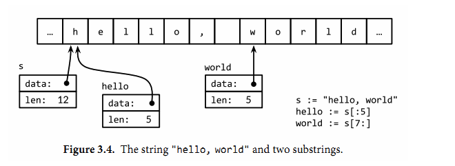
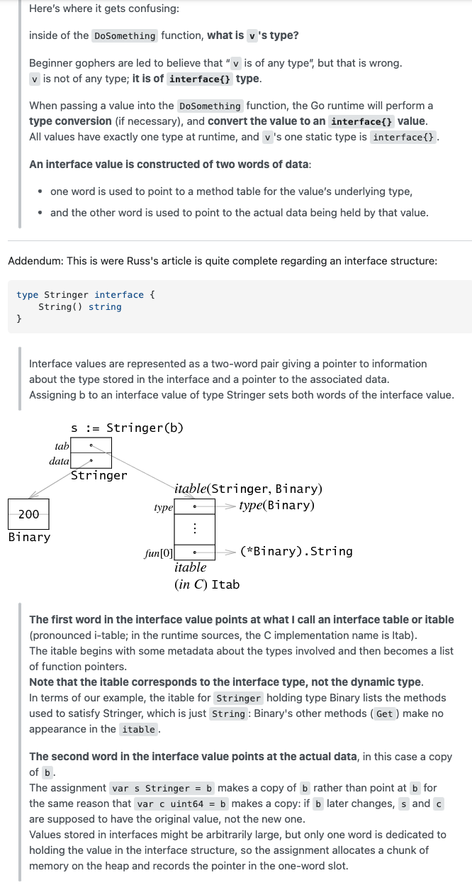

## Golang Basic

[toc]

## 程序结构

在函数中，简洁赋值语句 := 可在类型明确的地方代替 var 声明。函数外的每个语句都必须以关键字开始（var, func 等等），因此 := 结构不能在函数外使用。

Go 的基本类型有
```go
bool

string

int  int8  int16  int32  int64
uint uint8 uint16 uint32 uint64 uintptr

byte // uint8 的别名

rune // int32 的别名
    // 表示一个 Unicode 码点

float32 float64

complex64 complex128
```

for
```go
for initialization; condition; post{
    // zero or more statements
}
```

如果一个名字是在函数内部定义，那么它就只在函数内部有效。如果是在函数外部定义，那么将在当前包的所有文件中都可以访问。名字的开头字母的大小写决定了名字在包外的可见性。如果一个名字是大写字母开头的（译注：必须是在函数外部定义的包级名字；包级函数名本身也是包级名字），那么它将是导出的，也就是说可以被外部的包访问，例如fmt包的Printf函数就是导出的，可以在fmt包外部访问。包本身的名字一般总是用小写字母。

Four  major kinds  of declarations: `var`, `const`, `type`, and `func`.

请记住“`:=`”是一个变量声明语句，而“`=`”是一个变量赋值操作。局部变量，类型明确可推导

**指针** `*int`
在Go语言中，返回函数中局部变量的地址也是安全的。例如下面的代码，调用f函数时创建局部变量v，在局部变量地址被返回之后依然有效，因为指针p依然引用这个变量。
```go
var p = f()

func f() *int {
    v := 1
    return &v
}
```
`fmt.Println(f() == f()) // "false"`

**new函数**
另一个创建变量的方法是调用内建的new函数。表达式`new(T)`将创建一个T类型的匿名变量，初始化为T类型的零值，然后返回变量地址，返回的指针类型为`*T`。
用new创建变量和普通变量声明语句方式创建变量没有什么区别，除了不需要声明一个临时变量的名字外，我们还可以在表达式中使用new(T)。换言之，**new函数类似是一种语法糖**，而不是一个新的基础概念。

**完全不同于C++的生命周期机制**
因为一个变量的有效周期只取决于是否可达，因此一个循环迭代内部的局部变量的生命周期可能超出其局部作用域。同时，局部变量可能在函数返回之后依然存在。

编译器会`自动选择`在栈上还是在堆上分配局部变量的存储空间，但可能令人惊讶的是，**这个选择并不是由用var还是new声明变量的方式决定的**。
例子
```go
var global *int

func f() {
    var x int
    x = 1
    global = &x
}

func g() {
    y := new(int)
    *y = 1
}
```
f函数里的x变量必须在堆上分配，因为它在函数退出后依然可以通过包一级的global变量找到，虽然它是在函数内部定义的；`*y`并没有从函数g中逃逸，编译器可以选择在栈上分配`*y`的存储空间（译注：也可以选择在堆上分配，然后由Go语言的GC回收这个变量的内存空间）,虽然这里用的是new方式

**类型**
`type 类型名字 底层类型`
```go
type Celsius float64    // 摄氏温度
type Fahrenheit float64 // 华氏温度

const (
    AbsoluteZeroC Celsius = -273.15 // 绝对零度
    FreezingC     Celsius = 0       // 结冰点温度
    BoilingC      Celsius = 100     // 沸水温度
)
```
我们在这个包声明了两种类型：Celsius和Fahrenheit分别对应不同的温度单位。它们虽然有着相同的底层类型float64，但是它们是不同的数据类型，因此它们不可以被相互比较或混在一个表达式运算。刻意区分类型，可以避免一些像无意中使用不同单位的温度混合计算导致的错误；因此需要一个类似Celsius(t)或Fahrenheit(t)形式的显式转型操作才能将float64转为对应的类型。
```go
var c Celsius
var f Fahrenheit
fmt.Println(c == f)          // compile error: type mismatch
fmt.Println(c == Celsius(f)) // "true"!
```

不要将作用域和生命周期混为一谈。声明语句的作用域对应的是一个源代码的文本区域；它是一个**编译**时的属性。一个变量的生命周期是指程序运行时变量存在的有效时间段，在此时间区域内它可以被程序的其他部分引用；是一个**运行**时的概念。

## 基础数据类型

**运算符**
`&^     位清空 (AND NOT)`
位操作运算符&^用于按位置零（AND NOT）：如果对应y中bit位为1的话, 表达式z = x &^ y结果z的对应的bit位为0，否则z对应的bit位等于x相应的bit位的值。

一般来说，需要一个显式的转换将一个值从一种类型转化为另一种类型，并且算术和逻辑运算的二元操作中必须是相同的类型。虽然这偶尔会导致需要很长的表达式，但是它消除了所有和类型相关的问题，而且也使得程序容易理解。

```go
o := 0666
fmt.Printf("%d %[1]o %#[1]o\n", o) // "438 666 0666"
x := int64(0xdeadbeef)
fmt.Printf("%d %[1]x %#[1]x %#[1]X\n", x)
// Output:
// 3735928559 deadbeef 0xdeadbeef 0XDEADBEEF

ascii := 'a'
fmt.Printf("%d %[1]c %[1]q\n", ascii)   // "97 a 'a'"
```
通常Printf格式化字符串包含多个%参数时将会包含对应相同数量的额外操作数，但是%之后的[1]副词告诉Printf函数再次使用第一个操作数。第二，%后的#副词告诉Printf在用%o、%x或%X输出时生成0、0x或0X前缀。

**字符串**
文本字符串通常被解释为采用UTF8编码的Unicode码点（rune）序列
```go
s := "hello, world"
fmt.Println(s[:5]) // "hello"
fmt.Println(s[7:]) // "world"
fmt.Println(s[:])  // "hello, world"
```
**一个字符串包含的字节序列永远不会被改变**，当然我们也可以给一个字符串变量分配一个新字符串值。不变性意味着如果两个字符串共享相同的底层数据的话也是安全的，这使得复制任何长度的字符串代价是低廉的。同样，一个字符串s和对应的子字符串切片s[7:]的操作也可以安全地共享相同的内存，因此字符串切片操作代价也是低廉的。在这两种情况下都没有必要分配新的内存


**常量**
因为常量的值是在编译期就确定的，因此常量可以是构成类型的一部分，例如用于指定数组类`var p [IPv4Len]byte`

## 复合数据类型
数组和结构体是聚合类型；它们的值由许多元素或成员字段的值组成。数组是由同构的元素组成——每个数组元素都是完全相同的类型——结构体则是由异构的元素组成的。数组和结构体都是有固定内存大小的数据结构。相比之下，slice和map则是动态的数据结构，它们将根据需要动态增长。
### 数组
数组是一个由固定长度的特定类型元素组成的序列.
```go
var r [3]int = [3]int{1, 2}
q := [...]int{1, 2, 3}
fmt.Printf("%T\n", q) // "[3]int"
```
数组的长度是数组类型的一个组成部分，因此[3]int和[4]int是两种不同的数组类型。数组的长度必须是常量表达式，因为数组的长度需要在编译阶段确定。
**比较**
也可以指定一个索引和对应值列表的方式初始化`r := [...]int{99: -1}`
如果一个数组的元素类型是可以相互比较的，那么数组类型也是可以相互比较的，这时候我们可以直接通过==比较运算符来比较两个数组，只有当两个数组的所有元素都是相等的时候数组才是相等的。不相等比较运算符!=遵循同样的规则。

## Slice
Slice（切片）代表变长的序列，序列中每个元素都有相同的类型。一个slice类型一般写作[]T，其中T代表slice中元素的类型；slice的语法和数组很像，只是没有固定长度而已。

slice和数组的字面值语法很类似，它们都是用花括弧包含一系列的初始化元素，但是对于slice并没有指明序列的长度。这会隐式地创建一个合适大小的数组，然后slice的指针指向底层的数组。
内置的make函数创建一个指定元素类型、长度和容量的slice。容量部分可以省略，在这种情况下，容量将等于长度。
```go
make([]T, len)
make([]T, len, cap) // same as make([]T, cap)[:len]
```
在底层，make创建了一个匿名的数组变量，然后返回一个slice；只有通过返回的slice才能引用底层匿名的数组变量。

数组和slice之间有着紧密的联系。一个slice由三个部分构成：指针、长度和容量。指针指向第一个slice元素对应的底层数组元素的地址，要注意的是slice的第一个元素并不一定就是数组的第一个元素。长度对应slice中元素的数目；长度不能超过容量，容量一般是从slice的开始位置到底层数据的结尾位置。内置的len和cap函数分别返回slice的长度和容量。

因为slice值包含指向第一个slice元素的指针，因此**向函数传递slice将允许在函数内部修改底层数组的元素**。换句话说，复制一个slice只是对底层的数组创建了一个新的slice别名。同时，应该认识到**slice赋值O(1)时间复杂度，非常方便赋值，创建**

**append**
一样涉及capacity和length之间的扩张问题，考虑max(oldlength*2, newcapacity)作为新的capacity，如果无需扩容直接`z = x[:zlen]`，slice扩张非常方便；如果需要扩容，先扩容复制。

slice底层删除可以用后边覆盖前边，然后截取前边的思路做

### map
哈希表是一种巧妙并且实用的数据结构。它是一个无序的key/value对的集合，其中所有的key都是不同的，然后通过给定的key可以在常数时间复杂度内检索、更新或删除对应的value。在Go语言中，一个map就是**一个哈希表的引用**，map类型可以写为map[K]V，其中K和V分别对应key和value。**其中K对应的key必须是支持==比较运算符的数据类型**
```go
var ages map[string]int //nil map
ages := make(map[string]int) // mapping from strings to ints
ages := map[string]int{
    "alice":   31,
    "charlie": 34,
}
map[string]int{}//空类型
delete(ages, "alice") // remove element ages["alice"]
```
如果元素类型是一个数字，你可能需要区分一个已经存在的0，和不存在而返回零值的0，可以像下面这样测试
`if age, ok := ages["bob"]; !ok { /* ... */ }`

Go 语言使用拉链法来解决哈希碰撞的问题实现了哈希表，它的访问、写入和删除等操作都在编译期间转换成了运行时的函数或者方法。哈希在每一个桶中存储键对应哈希的前 8 位，当对哈希进行操作时，这些 `tophash` 就成为可以帮助哈希快速遍历桶中元素的缓存。

哈希表的每个桶都只能存储 8 个键值对，一旦当前哈希的某个桶超出 8 个，新的键值对就会存储到哈希的溢出桶中。随着键值对数量的增加，溢出桶的数量和哈希的装载因子也会逐渐升高，超过一定范围就会触发扩容，扩容会将桶的数量翻倍，元素再分配的过程也是在调用写操作时增量进行的，不会造成性能的瞬时巨大抖动。

### 结构体
结构体是一种聚合的数据类型，是由零个或多个任意类型的值聚合成的实体。
点操作符也可以和指向结构体的指针一起工作：
**初始化**
```go
p := Point{1, 2}
anim := gif.GIF{LoopCount: nframes}
isafunction(Point{1,2})//匿名
```
```go
var employeeOfTheMonth *Employee = &dilbert
employeeOfTheMonth.Position += " (proactive team player)"
//相当于下面语句
(*employeeOfTheMonth).Position += " (proactive team player)"
```
结构体值传递并不方便，**所以请多注意指针的使用**，go中结构体的指针使用还挺方便的
如果结构体成员名字是以大写字母开头的，那么该成员就是导出的；这是Go语言导出规则决定的。一个结构体可能同时包含导出和未导出的成员。（weak数据保护）
如果结构体的全部成员都是可以比较的，那么结构体也是可以比较的，那样的话两个结构体将可以使用==或!=运算符进行比较。由此可知道，struct可以作为map的key

**构体嵌入和匿名成员**
```go
type Point struct{
    X,Y int
}

type Circle struct {
    Point//匿名成员
    Radius int
}

type Wheel struct {
    Circle//匿名成员 仍然是has a的关系
    Spokes int
}
```
可以简化嵌入结构体中叶子节点访问
```go
var w Wheel
w.X = 8            // equivalent to w.Circle.Point.X = 8
w.Y = 8            // equivalent to w.Circle.Point.Y = 8
w.Radius = 5       // equivalent to w.Circle.Radius = 5
w.Spokes = 20
```
在右边的注释中给出的显式形式访问这些叶子成员的语法依然有效，因此匿名成员并不是真的无法访问了。其中匿名成员Circle和Point都有自己的名字——就是命名的类型名字——但是这些名字在点操作符中是可选的。我们在访问子成员的时候可以忽略任何匿名成员部分。
但是结构体字面值必须遵循形状类型声明时的结构
```go
w = Wheel{Circle{Point{8, 8}, 5}, 20}

w = Wheel{
    Circle: Circle{
        Point:  Point{X: 8, Y: 8},
        Radius: 5,
    },
    Spokes: 20, // NOTE: trailing comma necessary here (and at Radius)
}
```
**因为成员的名字是由其类型隐式地决定的，所以匿名成员也有可见性的规则约束。**

strcut嵌套关系是 `has a` 关系，而不是`is a`关系，外层strcut可以使用内层struct全部成员和方法，所以如果一个内层struct实现了一个`interface`，外层struct自动拥有了这个实现。

外层struct的同名方法可以覆盖(shadowing)内层struct的方法，`Circle.Point.Sting()`可以调用内层被覆盖方法

### JSON
[json](https://docs.hacknode.org/gopl-zh/ch4/ch4-05.html)

## 函数
函数声明包括函数名、形式参数列表、返回值列表（可省略）以及函数体。
```go
func name(parameter-list) (result-list) {
    body
}
```
backtracking使用slice非常方便
> 当outline调用自身时，被调用者接收的是stack的拷贝。被调用者对stack的元素追加操作，修改的是stack的拷贝，其可能会修改slice底层的数组甚至是申请一块新的内存空间进行扩容；但这个过程并不会修改调用方的stack。因此当函数返回时，调用方的stack与其调用自身之前完全一致。
```go
func outline(stack []string, n *html.Node) {
    if n.Type == html.ElementNode {
        stack = append(stack, n.Data) // push tag
        fmt.Println(stack)
    }
    for c := n.FirstChild; c != nil; c = c.NextSibling {
        outline(stack, c)
    }
}
```
大部分编程语言使用固定大小的函数调用栈，常见的大小从64KB到2MB不等。固定大小栈会限制递归的深度，当你用递归处理大量数据时，需要避免栈溢出；除此之外，还会导致安全性问题。与此相反，Go语言使用可变栈，栈的大小按需增加(初始时很小)。这使得我们使用递归时不必考虑溢出和安全问题。

### Error
对于大部分函数而言，永远无法确保能否成功运行。这是因为错误的原因超出了程序员的控制。举个例子，任何进行I/O操作的函数都会面临出现错误的可能，只有没有经验的程序员才会相信读写操作不会失败，即使是简单的读写。因此，当本该可信的操作出乎意料的失败后，我们必须弄清楚导致失败的原因。
在Go的错误处理中，错误是软件包API和应用程序用户界面的一个重要组成部分，**程序运行失败仅被认为是几个预期的结果之一,而非异常**
```go
fmt.Println(err)
fmt.Printf("%v", err)
```
使用`fmt.Errorf("parsing %s as HTML: %v", url,err)`补充错误信息，fmt.Errorf函数使用`fmt.Sprintf`格式化错误信息并返回
**处理错误的策略**

- 传递错误信息`fmt.Errorf("parsing %s as HTML: %v", url,err)`
- 有限时间/次数的重试
- 在main函数中输出错误信息并终止程序
```go
fmt.Fprintf(os.Stderr, "Site is down: %v\n", err)
os.Exit(1)
//等价于
log.Fatalf("Site is down: %v\n", err)
```
- 只输出错误信息，继续
- 忽略错误 - 不要这么做，或者写明意图
### 函数变量
```go
func square(n int) int { return n * n }
f:=square
```
类似于C++函数指针，函数变量可以作为函数参数传递行为
```go
func forEachNode(n *html.Node, pre, post func(n *html.Node)){
    // pre, post 传函数实现前序和后序遍历--泛型
}
```

### 匿名函数
类似于lambda函数plus，匿名函数核心在于**函数中定义函数**，优势在于闭包，使用函数之外的变量（自由变量），相比lambda函数不限制长度。匿名函数可以赋值名称，从而递归调用。
**注意！警告：捕获迭代变量**
```go
var rmdirs []func()
for _, dir := range tempDirs() {
    os.MkdirAll(dir, 0755)
    rmdirs = append(rmdirs, func() {
        os.RemoveAll(dir) // NOTE: incorrect!
    })
}
```
在上面的程序中，for循环语句引入了新的词法块，循环变量dir在这个词法块中被声明。在该循环中生成的所有函数值都共享相同的循环变量。**需要注意，函数值中记录的是循环变量的内存地址，而不是循环变量某一时刻的值**。以dir为例，后续的迭代会不断更新dir的值，当删除操作执行时，for循环已完成，dir中存储的值等于最后一次迭代的值。这意味着，每次对os.RemoveAll的调用删除的都是相同的目录。
需要做
```go
for _, dir := range tempDirs() {
    dir := dir // declares inner dir, initialized to outer dir
    // ...
}
```
这个问题不仅存在基于range的循环，在下面的例子中，**对循环变量i的使用也存在同样的问题**：(和C++完全不同)
```go
for i := 0; i < len(dirs); i++ {
    os.MkdirAll(dirs[i], 0755) // OK
    rmdirs = append(rmdirs, func() {
        os.RemoveAll(dirs[i]) // NOTE: incorrect!
    })
}
```
循环中只能记录地址，所以使用即刻状态时候可以，不能储存为下一刻的状态

### 变长函数
```go
func sum(vals...int) int {}
fmt.Println(sum(1, 2, 3, 4)) // "10"
values := []int{1, 2, 3, 4}
fmt.Println(sum(values...)) // "10"
```

### defer
当执行到该条语句时，函数和参数表达式得到计算，但直到包含该defer语句的函数执行完毕时，defer后的函数才会被执行，不论包含defer语句的函数是通过return正常结束，还是由于panic导致的异常结束。
作用：
1. 释放资源：defer语句经常被用于处理成对的操作，如打开、关闭、连接、断开连接、加锁、释放锁。通过defer机制，不论函数逻辑多复杂，都能保证在任何执行路径下，资源被释放。释放资源的defer应该直接跟在请求资源的语句后。
2. 调试开始和退出`defer trace("args") ()`后边要有圆括号
3. defer在return之后执行，可以打印出return结果
4. 循环中打开释放资源应该封装函数，否则defer释放会等到所有的打开都执行完再最后释放
defer在栈中，所以多个defer是倒序执行退出的

### panic
由于panic会引起程序的崩溃，因此panic一般用于严重错误，如程序内部的逻辑不一致。勤奋的程序员认为任何崩溃都表明代码中存在漏洞，**所以对于大部分漏洞，我们应该使用Go提供的错误机制，而不是panic**，尽量避免程序的崩溃。在健壮的程序中，任何可以预料到的错误，如不正确的输入、错误的配置或是失败的I/O操作都应该被优雅的处理，最好的处理方式，就是使用Go的错误机制。
## 方法
### 方法声明
```go
// same thing, but as a method of the Point type
func (p Point) Distance(q Point) float64 {
    return math.Hypot(q.X-p.X, q.Y-p.Y)
}
```
上面的代码里那个附加的参数p，叫做方法的接收器(receiver)
在Go语言里，我们为一些简单的数值、字符串、slice、map来定义一些附加行为很方便。**我们可以给同一个包内的任意命名类型定义方法**，只要这个命名类型的底层类型
对于一个给定的类型，其内部的方法都必须有唯一的方法名，但是不同的类型却可以有同样的方法名(**namespace的概念**)

### 指针接收者
> 在现实的程序里，一般会约定如果Point这个类有一个指针作为接收器的方法，那么所有Point的方法都必须有一个指针接收器，即使是那些并不需要这个指针接收器的函数。

**接收器实参是类型T，但接收器形参是类型`*T`**
为了避免歧义，在声明方法时，如果一个类型名本身是一个指针的话，是不允许其出现在接收器中的
如果接收器p是一个Point类型的变量，并且其方法需要一个Point指针作为接收器，我们可以用下面这种简短的写法：`p.ScaleBy(2)`
编译器会隐式地帮我们用`&p`去调用ScaleBy这个方法。这种简写方法只适用于“**变量**”，包括struct里的字段比如p.X，以及array和slice内的元素比如perim[0]。我们不能通过一个无法取到地址的接收器来调用指针方法，比如临时变量的内存地址就无法获取得到：
```go
Point{1, 2}.ScaleBy(2) // compile error: can't take address of Point literal
```
**反过来,接收器实参是类型`*T`，形参是类型T**
但是我们可以用一个*Point这样的接收器来调用Point的方法，因为我们可以通过地址来找到这个变量，只要用解引用符号*来取到该变量即可。编译器在这里也会给我们隐式地插入*这个操作符，所以下面这两种写法等价的：
```go
pptr.Distance(q)
(*pptr).Distance(q)
```
**实例复制**
如果命名类型T（译注：用type xxx定义的类型）的所有方法都是用T类型自己来做接收器（而不是*T），那么拷贝这种类型的实例就是安全的；调用他的任何一个方法也就会产生一个值的拷贝。比如time.Duration的这个类型，在调用其方法时就会被全部拷贝一份，包括在作为参数传入函数的时候。但是如果一个方法使用指针作为接收器，你需要避免对其进行拷贝，因为这样可能会破坏掉该类型内部的不变性。比如你对bytes.Buffer对象进行了拷贝，那么可能会引起原始对象和拷贝对象只是别名而已，实际上它们指向的对象是一样的。紧接着对拷贝后的变量进行修改可能会有让你有意外的结果。
**绑定到receiver上可以理解为receiver是method的额外参数，所以value receiver和pointer receiver都遵循函数传参的规则，pointer可以修改receiver本身，value不可以**
> 不管你的method的receiver是指针类型还是非指针类型，都是可以通过指针/非指针类型进行调用的，编译器会帮你做类型转换。
在声明一个method的receiver该是指针还是非指针类型时，你需要考虑两方面的因素，第一方面是这个对象本身是不是特别大，如果声明为非指针变量时，调用会产生一次拷贝；第二方面是如果你用指针类型作为receiver，那么你一定要注意，这种指针类型指向的始终是一块内存地址，就算你对其进行了拷贝。熟悉C或者C++的人这里应该很快能明白。

### 封装
go作为一个不是面向对象的语言，也具有对包外封装能力（依靠名字开头的大小写字母），对包内是完全透明可见的。
一个对象的变量或者方法如果对调用方是不可见的话，一般就被定义为“封装”。封装有时候也被叫做信息隐藏，同时也是面向对象编程最关键的一个方面。
**如果我们想要封装一个对象，我们必须将其定义为一个struct。**
**封装提供了三方面的优点**
首先，因为调用方不能直接修改对象的变量值，其只需要关注少量的语句并且只要弄懂少量变量的可能的值即可
第二，隐藏实现的细节，可以防止调用方依赖那些可能变化的具体实现，这样使设计包的程序员在不破坏对外的api情况下能得到更大的自由。
封装的第三个优点也是最重要的优点，是阻止了外部调用方对对象内部的值任意地进行修改。

## Interface接口
它不会暴露出它所代表的对象的内部值的结构和这个对象支持的基础操作的集合；它们只会表现出它们自己的方法。也就是说当你有看到一个接口类型的值时，你不知道它是什么，唯一知道的就是可以通过它的方法来做什么。
**https://stackoverflow.com/questions/23148812/whats-the-meaning-of-interface/23148998#23148998**

### error
error是一个接口
```go
type error interface {
    Error() string
}
```
errors.New构造error Interface
```go
func New(text string) error { return &errorString{text} }

type errorString struct { text string }

func (e *errorString) Error() string { return e.text}
```

### 类型断言
类型断言是一个使用在接口值上的操作。语法上它看起来像x.(T)被称为断言类型，这里x表示一个接口的类型和T表示一个类型。一个类型断言检查它操作对象的动态类型是否和断言的类型匹配。
第一种，如果断言的类型T是一个具体类型。如果这个检查成功了，类型断言的结果是x的动态值，当然它的类型是T。换句话说，具体类型的类型断言从它的操作对象中获得具体的值。如果检查失败，接下来这个操作会抛出panic。
第二种，如果相反地断言的类型T是一个接口类型。换句话说，对一个接口类型的类型断言改变了类型的表述方式，改变了可以获取的方法集合（通常更大），但是它保留了接口值内部的动态类型和值的部分。

如果类型断言出现在一个预期有两个结果的赋值操作中，例如如下的定义，这个操作不会在失败的时候发生panic，但是替代地返回一个额外的第二个结果，这个结果是一个标识成功与否的布尔值
```go
var w io.Writer = os.Stdout
f, ok := w.(*os.File)      // success:  ok, f == os.Stdout
b, ok := w.(*bytes.Buffer) // failure: !ok, b == nil
```

## reflection
Go语言提供了一种机制，能够在运行时更新变量和检查它们的值、调用它们的方法和它们支持的内在操作，而不需要在编译时就知道这些变量的具体类型。这种机制被称为反射。反射也可以让我们将类型本身作为第一类的值类型处理。
### Type
一个 Type 表示一个Go类型。它是一个接口，有许多方法来区分类型以及检查它们的组成部分，例如一个结构体的成员或一个函数的参数等。
```go
t := reflect.TypeOf(3)  // a reflect.Type
fmt.Println(t.String()) // "int"
fmt.Println(t)          // "int"
```
**回到 7.5节 的将一个具体的值转为接口类型会有一个隐式的接口转换操作，它会创建一个包含两个信息的接口值：操作数的动态类型（这里是 int）和它的动态的值（这里是 3）。**
因为 reflect.TypeOf 返回的是一个动态类型的接口值，它总是返回具体的类型。因此，下面的代码将打印 "*os.File" 而不是 "io.Writer"

### Value
函数 reflect.ValueOf 接受任意的 interface{} 类型，并返回一个装载着其动态值的 reflect.Value。和 reflect.TypeOf 类似，reflect.ValueOf 返回的结果也是具体的类型，但是 reflect.Value 也可以持有一个接口值。
```go
v := reflect.ValueOf(3) // a reflect.Value
fmt.Println(v)          // "3"
fmt.Printf("%v\n", v)   // "3"
```

### Value 的方法
```go
func display(path string, v reflect.Value) {
    switch v.Kind() {
    case reflect.Invalid:
        fmt.Printf("%s = invalid\n", path)
    case reflect.Slice, reflect.Array:
        for i := 0; i < v.Len(); i++ {
            display(fmt.Sprintf("%s[%d]", path, i), v.Index(i))
        }
    case reflect.Struct:
        for i := 0; i < v.NumField(); i++ {
            fieldPath := fmt.Sprintf("%s.%s", path, v.Type().Field(i).Name)
            display(fieldPath, v.Field(i))
        }
    case reflect.Map:
        for _, key := range v.MapKeys() {
            display(fmt.Sprintf("%s[%s]", path,
                formatAtom(key)), v.MapIndex(key))
        }
    case reflect.Ptr:
        if v.IsNil() {
            fmt.Printf("%s = nil\n", path)
        } else {
            display(fmt.Sprintf("(*%s)", path), v.Elem())
        }
    case reflect.Interface:
        if v.IsNil() {
            fmt.Printf("%s = nil\n", path)
        } else {
            fmt.Printf("%s.type = %s\n", path, v.Elem().Type())
            display(path+".value", v.Elem())
        }
    default: // basic types, channels, funcs
        fmt.Printf("%s = %s\n", path, formatAtom(v))
    }
}
```
slice array string： Index(i)=Value
struct: Field(i)=Value
Ptr: Elem()=Value 指向的变量
Interface: Elem()动态值

## 并发编程

### Context

[`context.Context`](https://draveness.me/golang/tree/context.Context) 是 Go 语言在 1.7 版本中引入标准库的**接口**，该接口定义了四个需要实现的方法，其中包括

1. `Deadline` — 返回 [`context.Context`](https://draveness.me/golang/tree/context.Context) 被取消的时间，也就是完成工作的截止日期；
2. `Done` — 返回一个 Channel，这个 Channel 会在当前工作完成或者上下文被取消后关闭，多次调用 `Done` 方法会返回同一个 Channel；
3. `Err`— 返回`context.Context`结束的原因，它只会在`Done`方法对应的 Channel 关闭时返回非空的值；
   1. 如果 [`context.Context`](https://draveness.me/golang/tree/context.Context) 被取消，会返回 `Canceled` 错误；
   2. 如果 [`context.Context`](https://draveness.me/golang/tree/context.Context) 超时，会返回 `DeadlineExceeded` 错误；
4. `Value` — 从 [`context.Context`](https://draveness.me/golang/tree/context.Context) 中获取键对应的值，对于同一个上下文来说，多次调用 `Value` 并传入相同的 `Key` 会返回相同的结果，该方法可以用来传递请求特定的数据

```go
type Context interface {
	Deadline() (deadline time.Time, ok bool)
	Done() <-chan struct{}
	Err() error
	Value(key interface{}) interface{}
}
```

[`context`](https://github.com/golang/go/tree/master/src/context) 包中提供的 [`context.Background`](https://draveness.me/golang/tree/context.Background)、[`context.TODO`](https://draveness.me/golang/tree/context.TODO)、[`context.WithDeadline`](https://draveness.me/golang/tree/context.WithDeadline) 和 [`context.WithValue`](https://draveness.me/golang/tree/context.WithValue) 函数会返回实现该接口的私有**结构体**

#### context设计原理

在 Goroutine 构成的树形结构中对信号进行同步以减少计算资源的浪费是 [`context.Context`](https://draveness.me/golang/tree/context.Context) 的最大作用。我们可能会创建多个 Goroutine 来处理一次请求，而 [`context.Context`](https://draveness.me/golang/tree/context.Context) 的作用是在不同 Goroutine 之间同步请求特定数据、取消信号以及处理请求的截止日期。每一个 [`context.Context`](https://draveness.me/golang/tree/context.Context) 都会从最顶层的 Goroutine 一层一层传递到最下层。[`context.Context`](https://draveness.me/golang/tree/context.Context) 可以在上层 Goroutine 执行出现错误时，将信号及时同步给下层。


三个函数创建父子关系的context

```go
WithCancel(parent Context) (ctx Context, cancel CancelFunc)  //创建有cancle方法的子上下文
WithTimeout(parent Context, timeout time.Duration) (Context, CancelFunc)
WithDeadline(parent Context, d time.Time) (Context, CancelFunc)
```

### 同步原语和锁

#### 基本原语

Go 语言在 [`sync`](https://golang.org/pkg/sync/) 包中提供了用于同步的一些基本原语，包括常见的 [`sync.Mutex`](https://draveness.me/golang/tree/sync.Mutex)、[`sync.RWMutex`](https://draveness.me/golang/tree/sync.RWMutex)、[`sync.WaitGroup`](https://draveness.me/golang/tree/sync.WaitGroup)、[`sync.Once`](https://draveness.me/golang/tree/sync.Once) 和 [`sync.Cond`](https://draveness.me/golang/tree/sync.Cond)：


#### RWMutex

读写互斥锁 [`sync.RWMutex`](https://draveness.me/golang/tree/sync.RWMutex) 是细粒度的互斥锁，它不限制资源的并发读，但是读写、写写操作无法并行执行。

```go
type RWMutex struct {
	w           Mutex
	writerSem   uint32
	readerSem   uint32
	readerCount int32
	readerWait  int32
}
```

- `w` — 复用互斥锁提供的能力；
- `writerSem` 和 `readerSem` — 分别用于写等待读和读等待写：
- `readerCount` 存储了当前正在执行的读操作数量；
- `readerWait` 表示当写操作被阻塞时等待的读操作个数；

我们会依次分析获取写锁和读锁的实现原理，其中：

- 写操作使用 [`sync.RWMutex.Lock`](https://draveness.me/golang/tree/sync.RWMutex.Lock) 和 [`sync.RWMutex.Unlock`](https://draveness.me/golang/tree/sync.RWMutex.Unlock) 方法；
- 读操作使用 [`sync.RWMutex.RLock`](https://draveness.me/golang/tree/sync.RWMutex.RLock) 和 [`sync.RWMutex.RUnlock`](https://draveness.me/golang/tree/sync.RWMutex.RUnlock) 方法；

**总结：**

- 调用`sync.RWMutex.Lock`尝试获取写锁时；
  - 每次 [`sync.RWMutex.RUnlock`](https://draveness.me/golang/tree/sync.RWMutex.RUnlock) 都会将 `readerCount` 其减一，当它归零时该 Goroutine 会获得写锁；
  - 将 `readerCount` 减少 `rwmutexMaxReaders` 个数以阻塞后续的读操作；
  - 先获取mutex阻塞写锁；再减少readerCount阻塞读锁；检查是否所有读锁已经释放，否则进入休眠
- 调用 [`sync.RWMutex.Unlock`](https://draveness.me/golang/tree/sync.RWMutex.Unlock) 释放写锁时，会先通知所有的读操作，然后才会释放持有的互斥锁；
  - 先释增加readerCount释放读锁；再释放写锁
- 读锁的加锁方法 [`sync.RWMutex.RLock`](https://draveness.me/golang/tree/sync.RWMutex.RLock) 很简单，该方法会通过 [`sync/atomic.AddInt32`](https://draveness.me/golang/tree/sync/atomic.AddInt32) 将 `readerCount` 加一
  - 如果负数说明有正在使用的写锁，休眠等待
  - 非负数直接获得读锁
- 当 Goroutine 想要释放读锁时，会调用如下所示的 [`sync.RWMutex.RUnlock`](https://draveness.me/golang/tree/sync.RWMutex.RUnlock) 方法：
  - 如果返回值非负数，直接解锁成功
  - 如果返回值小于零，有一个写锁在等待所有读锁释放

#### WaitGroup

[`sync.WaitGroup`](https://draveness.me/golang/tree/sync.WaitGroup) 可以等待一组 Goroutine 的返回，一个比较常见的使用场景是批量发出 RPC 或者 HTTP 请求：

```go
requests := []*Request{...}
wg := &sync.WaitGroup{}
wg.Add(len(requests))

for _, request := range requests {
    go func(r *Request) {
        defer wg.Done()
        // res, err := service.call(r)
    }(request)
}
wg.Wait()
```


**小结** 

通过对 [`sync.WaitGroup`](https://draveness.me/golang/tree/sync.WaitGroup) 的分析和研究，我们能够得出以下结论：

- [`sync.WaitGroup`](https://draveness.me/golang/tree/sync.WaitGroup) 必须在 [`sync.WaitGroup.Wait`](https://draveness.me/golang/tree/sync.WaitGroup.Wait) 方法返回之后才能被重新使用；
- [`sync.WaitGroup.Done`](https://draveness.me/golang/tree/sync.WaitGroup.Done) 只是对 [`sync.WaitGroup.Add`](https://draveness.me/golang/tree/sync.WaitGroup.Add) 方法的简单封装，我们可以向 [`sync.WaitGroup.Add`](https://draveness.me/golang/tree/sync.WaitGroup.Add) 方法传入任意负数（需要保证计数器非负）快速将计数器归零以唤醒等待的 Goroutine；
- 可以同时有多个 Goroutine 等待当前 [`sync.WaitGroup`](https://draveness.me/golang/tree/sync.WaitGroup) 计数器的归零，这些 Goroutine 会被同时唤醒；

#### Once

Go 语言标准库中 [`sync.Once`](https://draveness.me/golang/tree/sync.Once) 可以保证在 Go 程序运行期间的某段代码只会执行一次。

每一个 [`sync.Once`](https://draveness.me/golang/tree/sync.Once) 结构体中都只包含一个用于标识代码块是否执行过的 `done` 以及一个互斥锁 [`sync.Mutex`](https://draveness.me/golang/tree/sync.Mutex)：

```go
type Once struct {
	done uint32
	m    Mutex
}
```

[`sync.Once.Do`](https://draveness.me/golang/tree/sync.Once.Do) 是 [`sync.Once`](https://draveness.me/golang/tree/sync.Once) 结构体对外唯一暴露的方法，该方法会接收一个入参为空的函数：

- 如果传入的函数已经执行过，会直接返回；
- 如果传入的函数没有执行过，会调用 [`sync.Once.doSlow`](https://draveness.me/golang/tree/sync.Once.doSlow) 执行传入的函数
  - 获得互斥锁
  - 执行func ()无参函数
  - done置为1

#### Cond（条件变量）

Go 语言标准库中还包含条件变量 [`sync.Cond`](https://draveness.me/golang/tree/sync.Cond)，它可以让一组的 Goroutine 都在满足特定条件时被唤醒。

```go
var status int64

func main() {
	c := sync.NewCond(&sync.Mutex{})
	for i := 0; i < 10; i++ {
		go listen(c)
	}
	time.Sleep(1 * time.Second)
	go broadcast(c)

	ch := make(chan os.Signal, 1)
	signal.Notify(ch, os.Interrupt)
	<-ch
}

func broadcast(c *sync.Cond) {
	c.L.Lock()
	atomic.StoreInt64(&status, 1)
	c.Broadcast()
	c.L.Unlock()
}

func listen(c *sync.Cond) {
	c.L.Lock()
	for atomic.LoadInt64(&status) != 1 {
		c.Wait()
	}
	fmt.Println("listen")
	c.L.Unlock()
}

$ go run main.go
listen
...
listen
```

**结构体**

[`sync.Cond`](https://draveness.me/golang/tree/sync.Cond) 的结构体中包含以下 4 个字段：

```go
type Cond struct {
	noCopy  noCopy
	L       Locker
	notify  notifyList
	checker copyChecker
}
```

- `noCopy` — 用于保证结构体不会在编译期间拷贝；
- `copyChecker` — 用于禁止运行期间发生的拷贝；
- `L` — 用于保护内部的 `notify` 字段，`Locker` 接口类型的变量；
- `notify` — 一个 Goroutine 的链表，它是实现同步机制的核心结构；

[`sync.Cond.Signal`](https://draveness.me/golang/tree/sync.Cond.Signal) 和 [`sync.Cond.Broadcast`](https://draveness.me/golang/tree/sync.Cond.Broadcast) 就是用来唤醒陷入休眠的 Goroutine 的方法，它们的实现有一些细微的差别：

- [`sync.Cond.Signal`](https://draveness.me/golang/tree/sync.Cond.Signal) 方法会唤醒队列最前面的 Goroutine；
- [`sync.Cond.Broadcast`](https://draveness.me/golang/tree/sync.Cond.Broadcast) 方法会唤醒队列中全部的 Goroutine；

**小结**

[`sync.Cond`](https://draveness.me/golang/tree/sync.Cond) 不是一个常用的同步机制，但是在条件长时间无法满足时，与使用 `for {}` 进行忙碌等待相比，[`sync.Cond`](https://draveness.me/golang/tree/sync.Cond) 能够让出处理器的使用权，提高 CPU 的利用率。使用时我们也需要注意以下问题：

- [`sync.Cond.Wait`](https://draveness.me/golang/tree/sync.Cond.Wait) **在调用之前一定要使用获取互斥锁，否则会触发程序崩溃**；
- [`sync.Cond.Signal`](https://draveness.me/golang/tree/sync.Cond.Signal) 唤醒的 Goroutine 都是队列最前面、等待最久的 Goroutine；
- [`sync.Cond.Broadcast`](https://draveness.me/golang/tree/sync.Cond.Broadcast) 会按照一定顺序广播通知等待的全部 Goroutine；


## 常用系统包

### time
[time.Duration](https://studygolang.com/articles/12617)
```go
func Test() {
    var waitFiveHundredMillisections time.Duration = 500 * time.Millisecond

    startingTime := time.Now().UTC()
    time.Sleep(600 * time.Millisecond)
    endingTime := time.Now().UTC()

    var duration time.Duration = endingTime.Sub(startingTime)

    if duration >= waitFiveHundredMillisections {
        fmt.Printf("Wait %v\nNative [%v]\nMilliseconds [%d]\nSeconds [%.3f]\n", waitFiveHundredMillisections, duration, duration.Nanoseconds()/1e6, duration.Seconds())
    }
}
```

### timer

```go
c.timer = time.AfterFunc(dur, func() {
  c.cancel(true, DeadlineExceeded)
})
```

两种创建方式：`NewTimer` & `AfterFunc`

