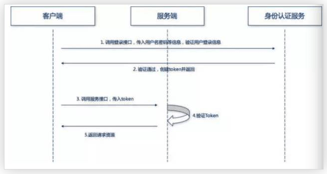

## 整理mini中学到的实战经验
### 鉴权方案讨论
https://learnku.com/articles/30704
讨论了单体和微服务背景下鉴权策略变更，和原因，和优劣
微服务下四种方法：
1. 单点登录（SSO）
2. 分布式 Session 方案
分布式会话方案原理主要是将关于用户认证的信息存储在共享存储中，且通常由用户会话作为 key 来实现的简单分布式哈希映射。当用户访问微服务时，用户数据可以从共享存储中获取。在某些场景下，这种方案很不错，用户登录状态是不透明的。同时也是一个高可用且可扩展的解决方案。这种方案的缺点在于共享存储需要一定保护机制，因此需要通过安全链接来访问，这时解决方案的实现就通常具有相当高的复杂性了。
3. **客户端 Token 方案**
令牌在客户端生成，由身份验证服务进行签名，并且必须包含足够的信息，以便可以在所有微服务中建立用户身份。令牌会附加到每个请求上，为微服务提供用户身份验证，这种解决方案的安全性相对较好，但身份验证注销是一个大问题，缓解这种情况的方法可以使用短期令牌和频繁检查认证服务等。对于客户端令牌的编码方案，Borsos 更喜欢使用 JSON Web Tokens（JWT），它足够简单且库支持程度也比较好。
4. 客户端 Token 与 API 网关结合
这个方案意味着所有请求都通过网关，从而有效地隐藏了微服务。在请求时，网关将原始用户令牌转换为内部会话 ID 令牌。在这种情况下，注销就不是问题，因为网关可以在注销时撤销用户的令牌。

### token

- 用户输入登录信息（或者调用 Token 接口，传入用户信息），发送到身份认证服务进行认证（身份认证服务可以和服务端在一起，也可以分离，看微服务拆分情况了）。
- 身份验证服务验证登录信息是否正确，返回接口（一般接口中会包含用户基础信息、权限范围、有效时间等信息），客户端存储接口，可以存储在 Session 或者数据库中。
- 用户将 Token 放在 HTTP 请求头中，发起相关 API 调用。
- 被调用的微服务，验证 Token 权限。
- 服务端返回相关资源和数据。

微服务中优势
- 服务端无状态：Token 机制在服务端不需要存储 session 信息，因为 Token 自身包含了所有用户的相关信息。
- 性能较好，因为在验证 Token 时不用再去访问数据库或者远程服务进行权限校验，自然可以提升不少性能。
- 支持移动设备。
- 支持跨程序调用，Cookie 是不允许垮域访问的，而 Token 则不存在这个问题。