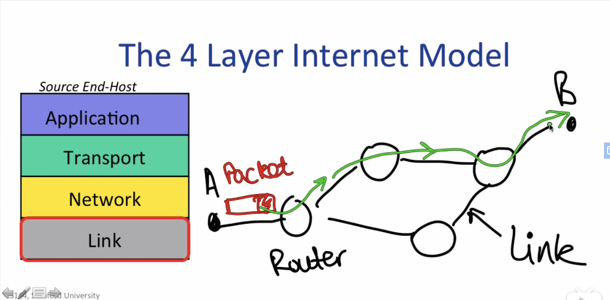
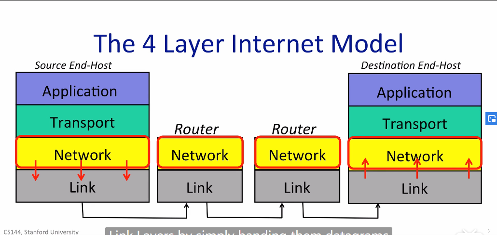
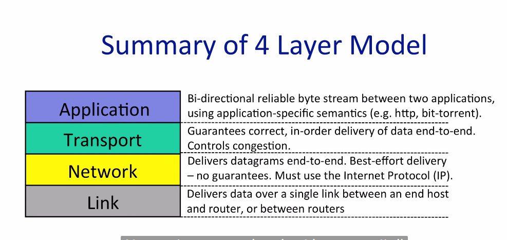
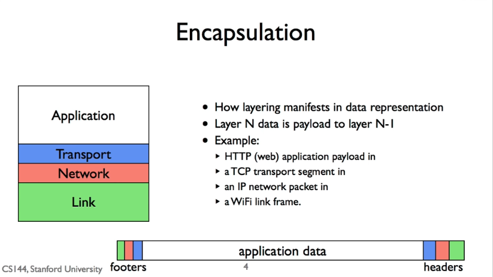
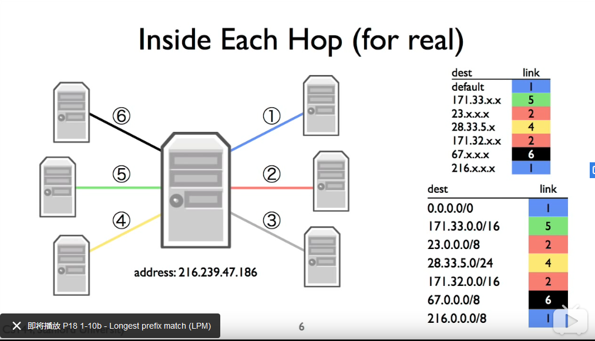
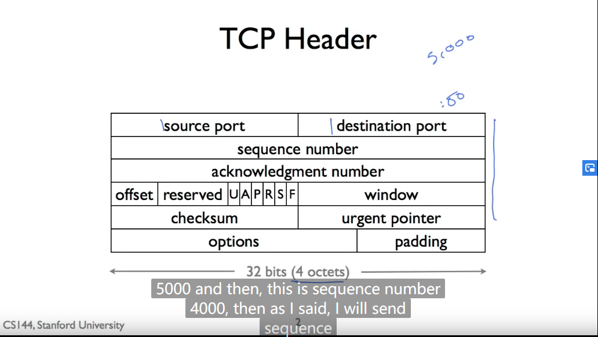

## Stanford CS144

### The Internet and IP introduction

1-1 applications
- www model: a reliable, bidirectional byte stream
world wide web(client->server)
- bittorrent(peer to peer): torrent(info about data files) -> tracker(list of clients with pieces of data files) -> clients
(through HTTP)
- skype(mix): client A want connection to client B(behind NAT)
A -> rendezvous server -> B; B -> A (reverse connection)
client A(behind NAT) want connection to client B(behind NAT)
A -> relay ->A; B -> relay -> B

1-2 The 4 layers Internet Model
- Internet made up of: end-hosts, routers, links

- Link layer: to carry the date over one link at a time
- Network layer: to deliver packets end-to-end across the Internet from the source to destination

- Internet Protocol(IP)
IP makes a attempt to deliver datagrams to destination, but it makes no promises.
IP datagrams can get lost, out of order, or corrupted. No guarantees.
- Transport layer: 
TCP 提供可靠性
UDP video无需可靠性
- Application layer
- layer: 封装 reuse

1-3 Network layer(IP)
property:
- Datagram (routing to the destination: IP SA, IP DA)
- Unreliable
- best effort(postal)(only drop if necessary, no detection)
- Connectionless

IP header:
TTL(time to live):decrease each router to prevent loop

1-5 Packets switching principles
Packets: IP包
statistical multiplexing:
- packet switching allows flows to use all available link capacity
- Packet switching allows flows to share links capacity

Summary:
- Simple: forward flows independently, don't need ot know about the flows
- efficient: share capacity among many flows

1-6 Layering principles
Each layer provides servises to the upper layer, using the servises of the layers below and its own private proceedings.

1-7 Encapsulation
layers and packets switching

1-8 Bytes order
Big Endian: (human reader)左边byte高位，右边byte低位
Little Endian: (computational) 右边byte高位，左边byte低位
**Network byte is big endian**
x86 is little endian
ARM is big endian
**convert the data when using network data**

1-9 IPv4
netmask: if same, within the same network, donot need a IP router
IPv4 address: network, host

1-10 Longest prefix match
- algorithm of forwarding:LPM
best prefix match

最长的prefix，否则default

1-11 Address resolution protocol
- Problem: have an IP address, what is the link address

Ethernet: 48bit address
map of link address and network address
IPSA, IPDA donnot change, LKSA, LKDA change after a link

1-12 The internet and IP Recap
- How applicatoin uses INternet
- structure of Internet: 4 layer model
- IP
- Basic architectural ideas and principles
packet switching
layering
encapsulation

### Transport

2-1 TCP servide model
三次握手和四次挥手
TCP可靠性
- header:
source port, destination port, seq number, ack number, checksum(16 bit, over the header and data),
- IP h+TCP h(address+port)
unique globally

2-1 UDP servise model
- header
source port, destination port, length(header+data), checksum(header+data+IPSA+IPDA+ID(UDP))

sample and fast

2-3 ICMP servise model
Internet Control Message protocol
To report error and diagnose problem of network layer
Network layer:
1. IP
2. Routing tables
3. ICMP

transport layer, provide info about network layer
report massage, unrealiable
ICMP type, code
application: ping,tracerouter(UDP TTL=n)

2-4 End to end principle
Function can **only completely and correctly** be implemented by application at the end point of the communication system. The system can only help(performance enhancement).

strong end to end principle
Everything should be done at fringes.(flexiblility, simplicity)

2-5 Error detection
checksum, CRC, MAC
checksum(IP,TCP)便宜，low garantee
CRC(Ethenet)最安全
MAC(TLS)security approach, no garantee

2-6 finite state machine
event and action

2-7 stop and wait
Flow control

- stop and wait
- sliding window

等到收到ack再发下一个包

2-8 Sliding window
maintain: window size, last acknum, last sentnum
ack含义：ack之前都收到了
1,2,3,5 -> ack=4
TCP相关：seq num, ack num, window size

2-9 Reliable --Retransmission strategy
timer

- go back N(entire window)
- selective repeat(only lost)√

2-10 Reliable --TCP header
typical 20 bytes long(4 bytes *5)

checksum: pseudo header(part of IP header), header, data

2-11 TCP setup and teardown
三次握手
simultaneous open: 同时发syn，同时回syn,ack（四次握手）
四次挥手
双方FIN才能关闭,time_wait(client)

