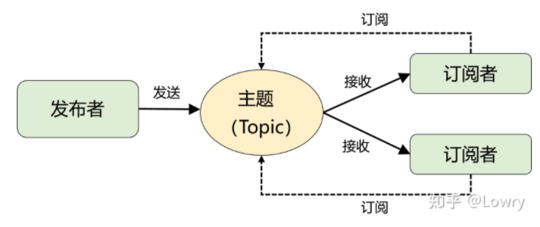
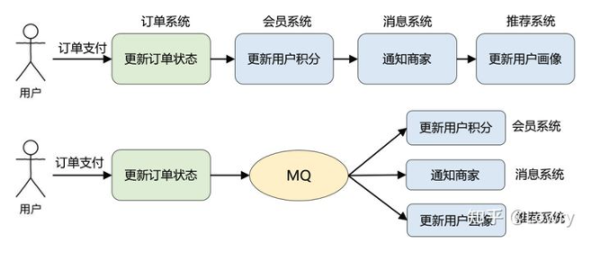
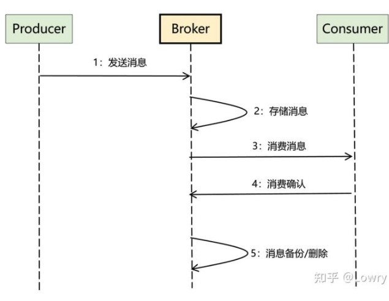
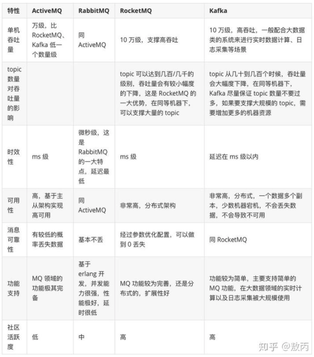

[toc]

## Message Queue

[文章](https://www.zhihu.com/question/54152397)
一发一存一消费
包含了两个关键词：消息和队列。 
1、消息：就是要传输的数据，可以是最简单的文本字符串，也可以是自定义的复杂格式（只要能按预定格式解析出来即可）。 
2、队列：大家应该再熟悉不过了，是一种先进先出数据结构。它是存放消息的容器，消息从队尾入队，从队头出队，入队即发消息的过程，出队即收消息的过程。

### 模型
队列模型
发布消费模型

单播和广播的区别。而且，当发布-订阅模型中只有 1 个订阅者时，它和队列模型就一样了，因此在功能上是完全兼容队列模型的。

### 作用
系统解耦、异步通信和流量削峰。除此之外，还有延迟通知、最终一致性保证、顺序消息、流式处理等等。

### 应用场景

引入 MQ 后，订单支付现在只需要关注它最重要的流程：更新订单状态即可。其他不重要的事情全部交给 MQ 来通知。这便是 MQ 解决的最核心的问题：系统解耦。

改造前订单系统依赖 3 个外部系统，改造后仅仅依赖 MQ，而且后续业务再扩展（比如：营销系统打算针对支付用户奖励优惠券），也不涉及订单系统的修改，从而保证了核心流程的稳定性，降低了维护成本。

这个改造还带来了另外一个好处：因为 MQ 的引入，更新用户积分、通知商家、更新用户画像这些步骤全部变成了异步执行，能减少订单支付的整体耗时，提升订单系统的吞吐量。这便是 MQ 的另一个典型应用场景：异步通信。

除此以外，由于队列能转储消息，对于超出系统承载能力的场景，可以用 MQ 作为 “漏斗” 进行限流保护，即所谓的流量削峰。

### 设计一个MQ

**雏形实现核心功能**
一发一存一消费，这是 MQ 最核心的功能需求。另外，从技术维度来看 MQ 的通信模型，可以理解成：两次 RPC + 消息转储。

**写一个适用于生产环境的 MQ**

>1、Broker（服务端）：MQ 中最核心的部分，是 MQ 的服务端，核心逻辑几乎全在这里，它为生产者和消费者提供 RPC 接口，负责消息的存储、备份和删除，以及消费关系的维护等。 
>2、Producer（生产者）：MQ 的客户端之一，调用 Broker 提供的 RPC 接口发送消息。 
>3、Consumer（消费者）：MQ 的另外一个客户端，调用 Broker 提供的 RPC 接口接收消息，同时完成消费确认

具体难点和解决方案详见《文章》

### 总结
再总结下，要回答好：如何设计一个 MQ？
1、需要从功能性需求（收发消息）和非功能性需求（高性能、高可用、高扩展等）两方面入手。
2、功能性需求不是重点，能覆盖 MQ 最基础的功能即可，至于延时消息、事务消息、重试队列等高级特性只是锦上添花的东西。
3、最核心的是：能结合功能性需求，理清楚整体的数据流，然后顺着这个思路去考虑非功能性的诉求如何满足，这才是技术难点所在。

### MQ带来的问题：
- 系统复杂
重复消费、消息丢失、消息的顺序消费
- 数据一致性（分布式通病）
- 可用性

### 主流MQ对比:
