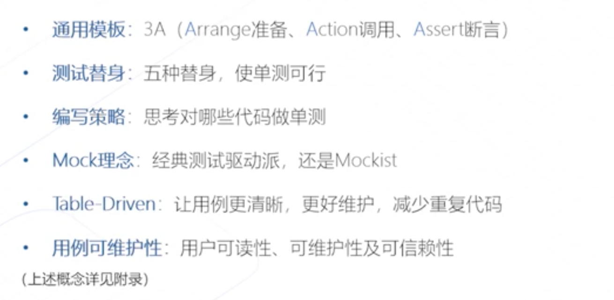

## Go 单测 iCode

1. 文件位置和命名
2. 引入testing库 断言
3. 执行go test几种方法
4. 查看结果覆盖率

测试框架
testify（assert）+gomonkey(mock)

用例编写
数据准备、调用、assert（3a）
黑盒 {正反测试（等价类）、边界测试}
白盒测试 {逻辑，路径}

反例：
- 过度设计
- 无用功

1. 需求
2. 代码
3. 易错类型

策略：基于意图，而不是基于实现写单测，思考测试哪些代码，风险点在哪里
写单测时候思考应该怎么样而不是代码实现怎么样

设计原则

代码怪味道
