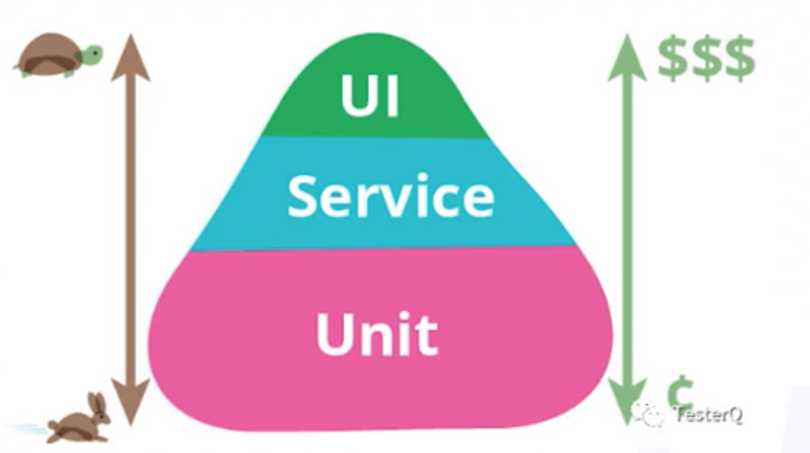

## 代码质量

A good code is like a good joke, it explains itself

### CLEAN
高内聚、
低耦合、
封装、
自主：行为和依赖的数据在一起，不互相干扰
无冗余

## 技术债

- 破窗效应
代码和学习生活都是如此
- 技术债
本金：修复质量问题需要的人力资源估计
年利息：代码质量造成的损失
负债率：偿还债务的资源/重写需要的资源
破产：负债率超过100%

### code smell
**对象函数问题**

- 过长函数
行数 缩进
- 参数列表
封装参数进对象、冗余参数、移除bool枚举分支变成多个小函数
- 基本类型偏执
- 过多switch case
策略模式\表驱动\责任链模式
If嵌套深：封装+卫函数
- 循环
管道 lambda

**对象函数据问题**

- 命名明确 explain
- 魔数 -> 枚举变量
- 全局数据带来的诡异bug
- 可变数据private控制
- 临时字段  作用域
- class应该有数据和行为

**对象关系问题**

- 过长关系链
- 中间人
- 委托取代继承？？

## 还债

**重构**
codedog 代码规范
代码重构《重构 改善既有代码的涉及》《设计模式》
设计重构《软件设计重构》

**单元测试**

