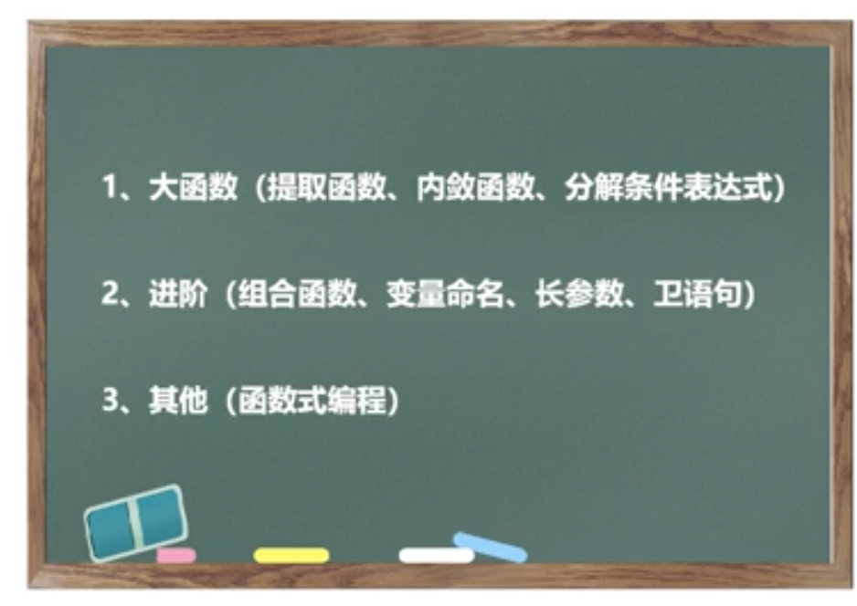

### 重构概念
单元测试、接口测试、分层测试  基石
可测性改造
sonar lint、code dog
IDE refactor

### 函数重构
IDE refactor是一个很好的工具
提取const
提取variable
提取函数
if谓语提取降低圈复杂度
长函数 
    ---拆解 短函数名称自注释
    ---抽象层次要一致
条件语句膨胀
    ---条件提取成函数
    ---策略模式、状态模式
基本类型偏执

### 类重构
面向接口而非面向实现
组合优于集成